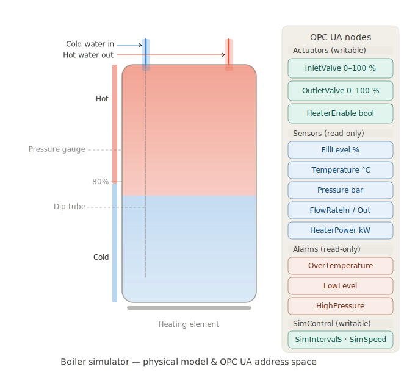

# OPC UA Boiler Simulator

A Python-based OPC UA server that simulates a hot-water boiler system for development and testing purposes. It exposes a realistic physical model — with actuators, sensors, and alarms — over an unauthenticated, unencrypted OPC UA endpoint.

NOTE: Development use only. This server has no security or authentication configured and should never be deployed in a production or networked environment.



---

## Features

- Realistic boiler physics: water mixing, heating, passive heat loss, pressure modelling
- Writable actuator nodes (inlet valve, outlet valve, heater)
- Read-only sensor nodes updated every second (fill level, temperature, pressure, flow rates, heater power)
- Boolean alarm nodes (over-temperature, low level, high pressure)
- Anonymous access, no encryption — connects instantly from any OPC UA client
- Fully self-contained single-file server

---

## Requirements

- Python 3.8+
- [asyncua](https://github.com/FreeOpcUa/opcua-asyncio)

Install dependencies:

```bash
pip install -r requirements.txt
```

---

## Getting Started

```bash
git clone https://github.com/your-username/your-repo.git
cd your-repo
pip install -r requirements.txt
python boiler_opcua_server.py
```

The server starts on:

```
opc.tcp://0.0.0.0:4840/boiler/
```

Connect with any OPC UA client (e.g. [UaExpert](https://www.unified-automation.com/products/development-tools/uaexpert.html), [Prosys OPC UA Browser](https://prosysopc.com/products/opc-ua-browser/)) using:

- **Endpoint:** `opc.tcp://localhost:4840/boiler/`
- **Security policy:** None
- **Authentication:** Anonymous

---

## OPC UA Address Space

```
Objects/
└── Boiler/
    ├── Actuators/              ← Writable nodes
    │   ├── InletValve          Float   0–100 %     Fresh water intake valve position
    │   ├── OutletValve         Float   0–100 %     Hot water outlet valve position
    │   └── HeaterEnable        Boolean             Heating element on/off
    │
    ├── Sensors/                ← Read-only, updated every second
    │   ├── FillLevel           Float   %           Water level in the boiler
    │   ├── Temperature         Float   °C          Water temperature
    │   ├── Pressure            Float   bar         Internal pressure
    │   ├── FlowRateIn          Float   L/min       Actual inlet flow rate
    │   ├── FlowRateOut         Float   L/min       Actual outlet flow rate
    │   └── HeaterPower         Float   kW          Actual heater power delivered
    │
    └── Alarms/                 ← Read-only boolean flags
        ├── OverTemperature     Boolean             Temperature exceeds 95 °C
        ├── LowLevel            Boolean             Fill level below 10 %
        └── HighPressure        Boolean             Pressure exceeds 3.5 bar

    └── SimControl/             ← Writable, adjust live via HMI sliders
        ├── SimIntervalS        Float   seconds     Wall-clock delay between ticks (min 0.1)
        └── SimSpeed            Float   ×           Physics seconds per tick (1.0 = real time)
```

---

## Physical Model

The simulation runs a 1-second tick and models the following:

| Parameter             | Default value |
|-----------------------|---------------|
| Boiler volume         | 200 L         |
| Heater rated power    | 6 kW          |
| Passive heat loss     | 0.3 kW        |
| Max inlet flow        | 20 L/min      |
| Max outlet flow       | 15 L/min      |
| Ambient temperature   | 20 °C         |

**Water level** rises and falls based on inlet and outlet valve positions. Incoming water is always at ambient temperature and mixes with existing water using energy conservation.

**Temperature** is driven by heater power minus passive losses. The heater derate as water approaches 100 °C and is hard-capped at boiling. The element is also disabled if the boiler runs dry.

**Pressure** is derived from both fill level and temperature:

```
P = P_atm + fill_factor × 0.5 + (T - 20°C) × 0.02
```

---

## Configuration

All physical constants are defined at the top of `boiler_opcua_server.py` and can be adjusted freely:

```python
BOILER_VOLUME_LITERS  = 200.0   # Total boiler capacity
HEATER_MAX_KW         = 6.0     # Heating element rated power
HEAT_LOSS_KW          = 0.3     # Passive heat loss
AMBIENT_TEMP_C        = 20.0    # Room temperature
MAX_FLOW_IN_LPM       = 20.0    # Max inlet flow at 100% valve
MAX_FLOW_OUT_LPM      = 15.0    # Max outlet flow at 100% valve
SIM_INTERVAL_S        = 1.0     # Simulation tick in seconds

ALARM_OVER_TEMP_C     = 95.0
ALARM_LOW_LEVEL_PCT   = 10.0
ALARM_HIGH_PRESSURE   = 3.5
```

---

## Speeding Up the Simulation

The simulation speed can be adjusted **live at runtime** by writing to the two `SimControl` nodes over OPC UA — no restart needed. Your HMI can expose these as sliders.

| Node | Type | Default | Effect |
|---|---|---|---|
| `SimControl/SimIntervalS` | Float | `1.0` | Wall-clock seconds between ticks. Lower = faster sensor refresh. Min `0.1`. |
| `SimControl/SimSpeed` | Float | `1.0` | Physics seconds simulated per tick. Higher = faster boiler dynamics. |

**Examples:**

- `SimSpeed = 10.0` → temperature, fill level, and pressure all change 10× faster than real time
- `SimIntervalS = 0.2` → OPC UA values update 5 times per second
- `SimSpeed = 0.1` → slow-motion mode for step-by-step testing

Both parameters are also configurable as startup defaults at the top of `boiler_opcua_server.py`:

```python
SIM_INTERVAL_S = 1.0   # default wall-clock tick (seconds)
SIM_SPEED      = 1.0   # default physics multiplier
```

### Quick reference

| Goal | What to change |
|---|---|
| Faster temperature rise / fill | Increase `SimSpeed` |
| Faster sensor refresh rate | Decrease `SimIntervalS` |
| Both | Increase `SimSpeed` **and** decrease `SimIntervalS` |
| Slow motion for debugging | Set `SimSpeed` to e.g. `0.1` |

---

## Docker deployment

The simulator ships with a multi-stage `Dockerfile` and a `docker-compose.yml` suitable for deployment on embedded Linux systems (e.g. Raspberry Pi, industrial PCs running Debian/Ubuntu).

### Quick start

```bash
# Build and start in the background
docker compose up -d

# Follow logs
docker compose logs -f

# Stop
docker compose down
```

The OPC UA endpoint will be available on the host at `opc.tcp://<device-ip>:4840/boiler/`.

### Building for a different architecture

If you are building on an x86 machine for an ARM-based embedded board (e.g. Raspberry Pi 4), use Docker's built-in cross-compilation:

```bash
# One-time setup — install the multi-platform builder
docker buildx create --use

# Build and push (or load) for ARM 64-bit
docker buildx build --platform linux/arm64 -t boiler-simulator:latest --load .

# Or build for 32-bit ARMv7 (older Pi models)
docker buildx build --platform linux/arm/v7 -t boiler-simulator:latest --load .
```

Then transfer the image to the target device:

```bash
docker save boiler-simulator:latest | ssh user@<device-ip> docker load
```

### Resource limits

The `docker-compose.yml` sets sensible defaults for a constrained embedded system:

| Parameter | Default | Notes |
|---|---|---|
| CPU limit | 50 % of 1 core | Lower to `0.25` on slower boards |
| Memory limit | 128 MB | Can be reduced to `64M` for minimal boards |
| Memory reservation | 32 MB | Guaranteed allocation at startup |

Adjust the `deploy.resources` block in `docker-compose.yml` to suit your hardware.

### Auto-start on boot

The `restart: unless-stopped` policy in the Compose file means the simulator will start automatically when the Docker daemon starts. To ensure Docker itself starts on boot:

```bash
sudo systemctl enable docker
```

### Health check

Docker monitors the container by attempting a TCP connection to port 4840 every 30 seconds. Check the current health status with:

```bash
docker inspect --format='{{.State.Health.Status}}' boiler-simulator
```

---

## Project Structure

```
.
├── boiler_opcua_server.py   # OPC UA server + physics simulation
├── requirements.txt         # Python dependencies
├── Dockerfile               # Multi-stage image build
├── docker-compose.yml       # Compose deployment with health check & resource limits
├── .dockerignore            # Keeps the image lean
├── docs/
│   └── boiler-diagram.svg   # Architecture diagram
└── README.md
```

---

## License

MIT License. See [LICENSE](LICENSE) for details.
